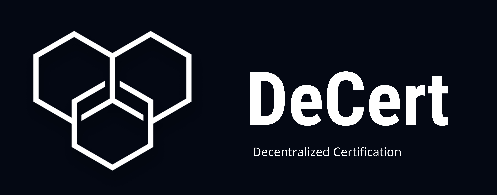
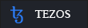

---

---

 

# Problem Statement 🤔

More and more Ed-Tech companies are trying to move into the Web3 and Metaverse space, the major issue faced by them is, dealing with a lot of new technology, and also managing the crypto funds and multiple accounts and contracts.
So a lot of Edu-Tech businesses/communities are trying to provide NFT certificates but there are too many things to handle for every single certificate

 

# Solution 💡

We are proving a simple fast API to ed-tech businesses to make their certificates
into NFTs and send to the receiver. We are making the NFTs non-transferable to
maintain the legitimacy of the certificates.

This provides complete ownership of the certificate to the receiver and the data
cannot be altered for lifetime, as it relies on blockchain immutable ledger technology.

And due to
some reason we shut down operations, the certificates of the users will still remain
with them for lifetime, no one can tamper with it.

 

# Architecture 🔩

#### Step 1 : Authentication

The user has to authenticate their ID using the google services and the app will generate the bearer token which provides you access to the services of our API.

#### Step 2 : Access to api routes

The generation of the api token you can now access the api routes and in turn this can be used to access our backend services without having a backend engineer.

#### Step 3 : Use it in your own application

We will be providing you with the documentation for the API which will be easy to implement as we’ll be providing you with our API docs.

#### Step 4 : Upload the certificate file

Upload the required file on the network, be it png or be it pdf, this can be uploaded to the network in given interface. Fill in the details of the certificates and the characteristic attributes of the required network.

#### Step 5 : Mint in preferred blockchain network

After the file has been uploaded to the webapp, choose the required network where the document is supposed to be minted. Block speed and gas fees are often varying in nature and is based off personal priorities, hence we are primarily working on 2 networks which are namely the Ethereum and the Polygon network.

#### Step 6 : Store in the ipfs of filecoin

The data which is now minted, on the desired network and is now stored on the decentralized IPFS filecoin network and is now a non transferrable single asset.The original data is now stord on the required network since the original file is now stored on the specific address in the blockchain address , the data is now immutable in the blockchain network and the final file is a MINTED SINGLE ASSET WHICH WILL BE NON TRANSFERRABLE

# Tech Stack 🧰

## Blockchain network ⛓️

-  Ethereum
-  Polygon
-  Tezos

## Backend 📦

-  Express.js
-  Node.js
-  Filecoin
-  Mongo DB

## Frontend 🖥️

-  React.js

## Smart Contract 📒

-  Solidity
-  Smartpy
- 

# Principle Idea

In the contemporary world, the need of skilled labour is immense and is only ensured when there is certification of the individual's credentials. The process of verification and storage of these certificates are a big hassle. Our API is the one stop solution to all of the problems at hand and aims to be the one solving this problem at

